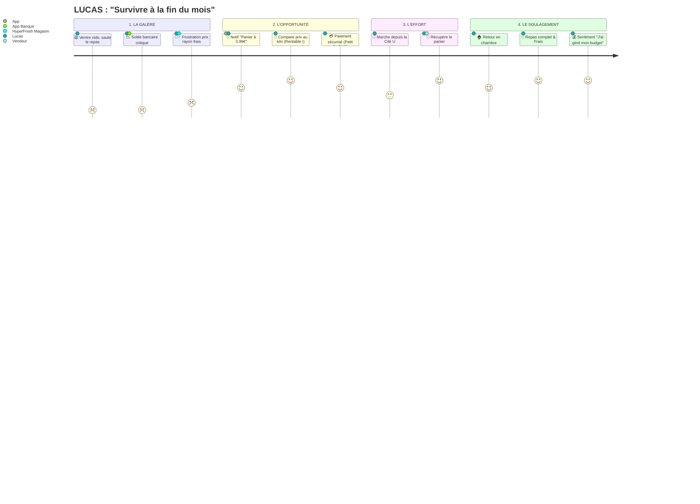
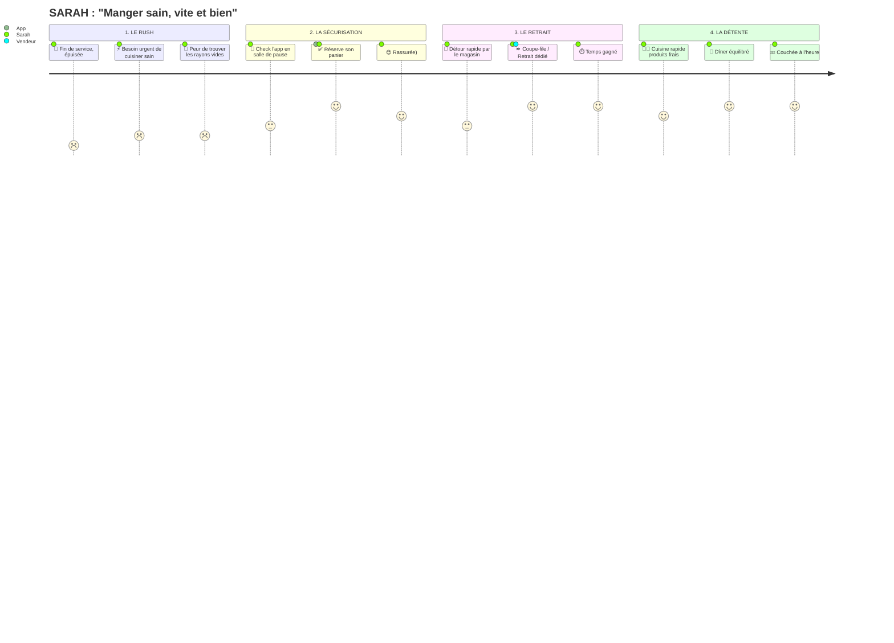

```mermaid
journey
    title LUCAS : "Survivre à la fin du mois"
    
    section 1. LA GALÈRE
      😫 Ventre vide, saute le repas: 1: Lucas
      📉 Solde bancaire critique: 1: Lucas, App Banque
      🤷‍♂️ Frustration prix rayon frais: 2: Lucas, HyperFresh Magasin

    section 2. L'OPPORTUNITÉ
      🔔 Notif "Panier à 3.99€": 4: App, Lucas
      📱 Compare prix au kilo (Rentable !): 5: Lucas
      💳 Paiement sécurisé (Petit budget): 4: Lucas

    section 3. L'EFFORT
      🚶 Marche depuis la Cité U: 3: Lucas
      👀 Récupère le panier: 5: Lucas, Vendeur

    section 4. LE SOULAGEMENT
      🏠 Retour en chambre: 4: Lucas
      🥗 Repas complet & Frais: 5: Lucas
      💰 Sentiment "J'ai géré mon budget": 5: Lucas
```

---

```mermaid
journey
    title SARAH : "Manger sain, vite et bien"
    
    section 1. LE RUSH
      🏥 Fin de service, épuisée: 1: Sarah
      ⚡ Besoin urgent de cuisiner sain: 2: Sarah
      🚫 Peur de trouver les rayons vides: 2: Sarah

    section 2. LA SÉCURISATION
      📱 Check l'app en salle de pause: 3: Sarah
      ✅ Réserve son panier: 5: App, Sarah
      😌 Rassurée): 4: Sarah

    section 3. LE RETRAIT
      🚗 Détour rapide par le magasin: 3: Sarah
      ⏩ Coupe-file / Retrait dédié: 5: Sarah, Vendeur
      ⏱️ Temps gagné: 5: Sarah

    section 4. LA DÉTENTE
      👩‍🍳 Cuisine rapide produits frais: 4: Sarah
      🥗 Dîner équilibré: 5: Sarah
      💤 Couchée à l'heure: 5: Sarah
```
